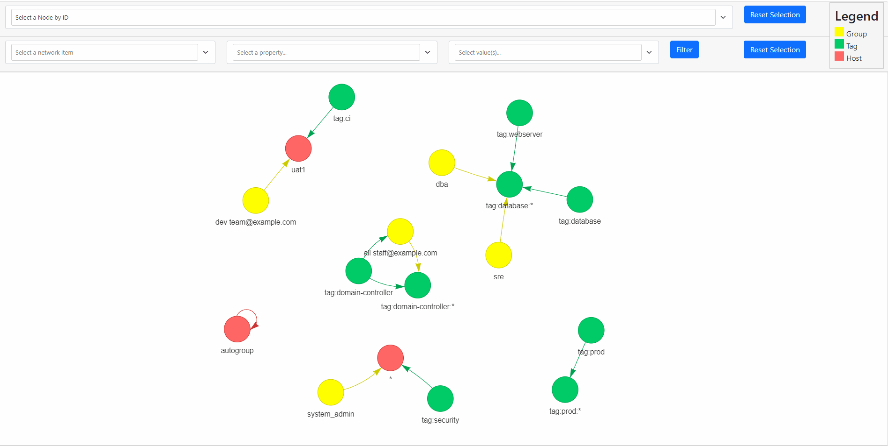

# Tailscale Network Topology Mapper
### A visual way to view your ACL rules for Tailscale
I occasionally find myself just wanting to get a glance of how my ACL rules look without reading through the code. This is also useful for showing how our policies are set up to people who are not devs by trade.

# Initial Set Up
0. You will need Python3 and git installed.
1. `git clone https://github.com/SimplyMinimal/tailscale-network-topology-mapper`
2. `cd tailscale-network-topology-mapper`
3. `pip install -r requirements.txt`
4. Copy your ACL policy  into the contents of the example `policy.hujson` 
5. Edit `create-network-map.py` and change `COMPANY_DOMAIN="example.com"` to your actual company domain 

# Execution
6. Run `python create-network-map.py` to generate your network map. It should produce an updated `network_topology.html` file that you can open in your browser.

You can filter down to specific groups or nodes using the filter bar at the top or by clicking on a node on the graph.

## Limitations
* This project is in an early alpha stage.
* It can only map what is available in the ACL policy file. It is not an active scanning tool that will seek out other hosts.
* It only focuses on the ACL rules themselves but eventually this may start capturing ALL the available valid ACL sections.

Pull requests welcome! :) 

## Experimental Ideas and TODOs
* Use `tailscale debug netmap` to build a more in-depth map
* Allow switching between layers such as port level, host level, user/group level
